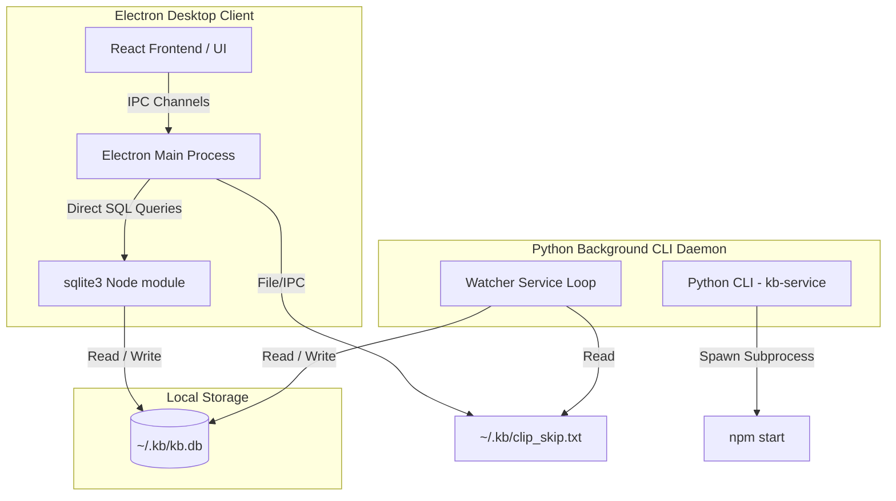

# Create KB Electron App & CLI Service Package

This skill guides the agent in creating a standalone service package for the `kb` (Knowledge Base) stack. The architecture consists of a Python-based CLI / background watcher daemon and an Electron / React client sharing a SQLite database at `~/.kb/kb.db`.

---

## Architecture Overview



---

## 1. Project Initialization & Environment Setup

### 1.1 Python Virtual Environment
- Configure dependencies in `pyproject.toml` including:
  - `kb-core` (git source: `https://github.com/Willmo103/kb-core.git`)
  - `typer` (CLI runner)
  - `sqlite-utils` (database helpers)
  - `pydantic` (data modeling)
  - `pywin32` (Windows API wrappers)
  - `Pillow` (Image manipulation)
- Configure the entrypoint script pointing to the Typer CLI:
  ```toml
  [project.scripts]
  kb-service = "kb_service.cli:kb_service_cli"
  ```
- Configure a `dev` dependency-group containing `pytest` and `pytest-mock`.
- Run `uv sync` to build the virtual environment.

### 1.2 Electron Package Configuration
In a `desktop/` directory, create:
- `package.json` specifying React 19, Lucide React, sqlite3, Electron, and electron-builder.
- `vite.config.js` outputting build assets to `dist-frontend`.
- `tailwind.config.js` declaring the standard retro/earth-toned solarized palette:
  ```javascript
  retro: {
    bg: { light: '#F4EFEA', dark: '#1C1917' },
    panel: { light: '#EAE0D5', dark: '#292524' },
    text: { light: '#3C2F2F', dark: '#E7E5E4' },
    border: { light: '#D0C0B0', dark: '#44403C' },
    orange: '#CB4B16', blue: '#268BD2', green: '#859900', yellow: '#B58900', red: '#DC322F'
  }
  ```
- `postcss.config.js` configuring tailwindcss.
- `index.html` loading the Outfit google font.

---

## 2. Python Backend & Watcher Implementation

### 2.1 Watcher Daemon (`watcher.py`)
- **Database Initialization**: Ensure the target tables and indexes are created natively using SQL commands.
- **Event Loop**: Poll clipboard or source API at a standard interval (e.g. 200ms).
- **Self-Copy Suppression**: Implement a file-based lock mechanism (`~/.kb/clip_skip.txt`) storing the hash of client-copied content to suppress logging duplicates.
- **Robust Exception Handling**: Wrap clipboard and IO calls in try-except-finally blocks to handle process locks natively.

### 2.2 Typer CLI (`cli.py`)
Expose the following commands:
- `watch`: Foreground synchronous watcher loop.
- `start`: detached background process running silently via **`pythonw.exe`** (so no terminal window stays open) and writing its process ID to `~/.kb/kb-service_watcher.pid`.
- `stop`: kills the background PID and unlinks the PID file.
- `status`: verifies if the PID is active.
- `install`: copies a silent startup batch launcher script into the Windows Startup directory (`AppData\Roaming\Microsoft\Windows\Start Menu\Programs\Startup`).
- `serve`: spawns the Electron application from the `desktop/` folder.

---

## 3. Electron Main Process & IPC Bridge

### 3.1 Main Process (`main.js`)
- **Direct Database Interface**: Open and query the shared SQLite database `~/.kb/kb.db` directly in Node using the `sqlite3` module.
- **Tray Icon**: Create a tray icon with click-to-focus toggling and a right-click context menu containing:
  - Toggle window command.
  - Active list of the 5 most recent items (click-to-copy).
  - Clean quit command.
- **Window Management**: 
  - Clicking the window close button should hide the app to the tray instead of quitting.
  - Implement a `blur` listener on the window to automatically hide it when focus is lost.
- **IPC Handlers**: Map direct DB calls (query lists, favorites toggle, clear records, detail views, JSON exports).
- **Skip Hash Writing**: When copying back to clipboard, calculate the SHA-256 hash and write it to `~/.kb/clip_skip.txt`.

### 3.2 Preload Bridge (`preload.js`)
- Expose the IPC methods to the React frontend in the global `window.api` object.

---

## 4. Pinned React/Tailwind Frontend

Design the frontend interface to match the exact `kb-image` look:
- **Pinned Layout**: Set the root wrapper to `h-screen overflow-hidden` and main containers to `overflow-hidden`. Apply `md:overflow-y-auto` only to the sidebar and list container to prevent scrolling the sidebar menu.
- **Search & Filters**: Search field + content type filters (Text, File, Image) + Favorite toggles.
- **Infinite Scrolling**: Use `IntersectionObserver` to trigger incremental paging queries on the list.
- **Detail Slider Drawer**: Standard right-side drawer that slides in on selection to display preview, timestamps, access logs, and action controls (Copy, Open Natively, Toggle Star, Delete).

---

## 5. Automated Build & Test Pipeline

### 5.1 Build Script (`build.py`)
Create a root-level `build.py` performing:
1. `npm install` and `npm run dist` inside `desktop/`.
2. `uv sync` in the root folder.
3. `uv run pytest` to execute unit tests.
4. `uv build` to compile the wheel/source distributions.

### 5.2 Verification & UAT
> [!IMPORTANT]
> The agent must run `npm run build` to compile Vite assets and invite the user to perform **User Acceptance Testing (UAT)** in their local environment before running the final `build.py` script. Only compile release builds after the user confirms everything works!
